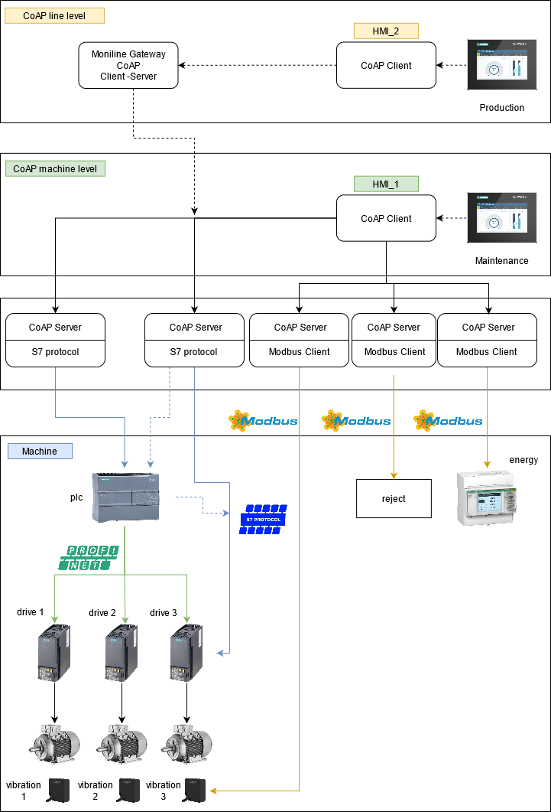

# CoAP-factory-monitoring
Industrial object modelling using CoAP protocol and Californium framework

## Description
CoAP-factory-monitoring implements a possible [IIoT](https://en.wikipedia.org/wiki/Industrial_internet_of_things) scenario for factory data exchange in an [Industry 4.0](https://en.wikipedia.org/wiki/Fourth_Industrial_Revolution) perspective with [CoAP](https://en.wikipedia.org/wiki/Fourth_Industrial_Revolution) protocol using [Californium](https://www.eclipse.org/californium/) framework.

The mains goals of this project are:
- Production monitoring in a manufacturing plant from different company levels
- Data distribution inside the plant using CoAP protocol for future data analysis and predictive maintenance
- Model different data acquisition devices for hiding low level field communication protocol implementation details

### Factory scenario

### Factory modelling

## Usage
The possible uses of this application are shown below:

### Run Master Repository
* Run MasterRepository.java in `it.beltek.ia.iotlab.edge.database`
### Run Device Gateway
Compose different machines and lines running a process contained in `it.beltek.ia.iotlab.edge.gateway`:
* **PlcGateway.java**
* **Pm3200Gateway.java**
* **RejectGateway.java**
* **DriveGateway.java**: run a process for each motor drive and specify also the drive numbers (Drive ID)
* **Qm42vt2Gateway.java**: run a process for each motor sensor and specify also the sensor numbers (Drive ID)

`config.properties` files contains possibile real system configuration (port, device name, line ID, machine ID, device ID).

### Run Moniline Gateway
* Run **MonilineGateway.java** in `it.beltek.ia.iotlab.edge.gateway.moniline` for each line.
Specify `portNumber` and `lineID`.

### HMI1 - HMIMaintenance
* Run **HmiMaintenance.java** in `it.beltek.ia.iotlab.edge.client` for each line.
* Specify `lineID`.

### HMI2 - HMIProduction
* Run **HmiProduction.java** in `it.beltek.ia.iotlab.edge.client`.

### How send command
It's possibile send commands to device using this syntax into console:
* **HMIMaintenance** console: `machineID_code_velocity_deviceID` (for example, to set 50 Hz speed of motor n.1 in machine n.1, send the following command: **1_10_50_1**)
* **HMIProduction** console: `lineID_machineID_code_value` (for example, to set 10 units/min production line velocity on machine n.1 in line n.1 , send the following command: **1_1_0_10**)

## Contribution

Thanks for your interest in contributing. Anybody is free to report bugs, unclear documentation, and other problems regarding this repository in the Issues section.

